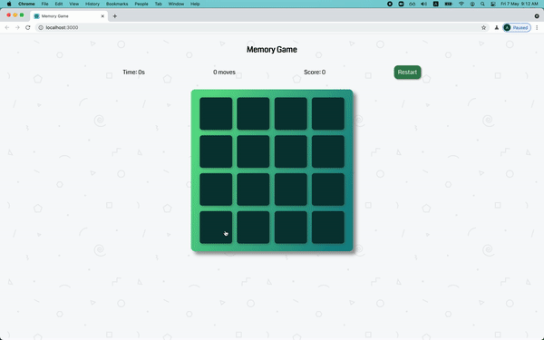
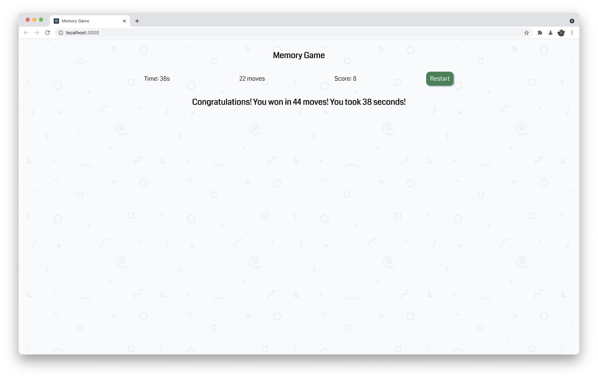

# Memory Game with React

Game finished:

## Colors
- Primary: rgba(96,221,142,1)
- Secondary: rgba(24,138,141,1)
- Gradient from [GradientHunt](https://gradienthunt.com/gradient/22202)

## Steps
This project is breakdown into steps and are listed down here...
- The main component is **Game** which handles all the game logic such as moves, time, score, match, game-over, restart-game.
- Inisde Game component there will be **Board** component which is 4 x 4 matrix.
- Each cell of **Board** will be another component called **Box**.
- **Board** and **Box** will be stateless.
- Icons will be added inside the **Box** using **Icon** component which contains all the svgs.

### Edge cases
- Clicking on the same tile twice
- Clicking on another tile while two tiles that you have selected are visible